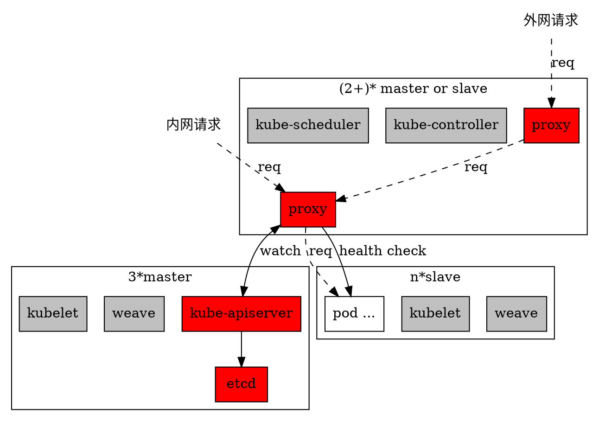


Kubernetes (K8s) is an open-source system for automating deployment, scaling, and management of containerized applications.


本文主要讲述如何部署一个用于web服务的高可用kubernates集群。该架构能够较好的适用于微服务体系，内置的服务发现机制给微服务治理带来了极佳的体验。

集群架构
----

话不多说，架构图如下：

这里，我们把集群相关服务分了三类：
- 必须部署在master上的服务
- 必须部署在slave上的服务
- master和slave都可以部署的服务

其中，kubelet和weave是集群内每台机器必须部署的服务，无需过多研究。

kube-shceduler和kube-controller主要用于集群管理，正常部署即可。

kube-apiserver和etcd是集群master核心，简单来说，集群所有相关服务都需要通过和apiserver通信来控制集群行为。

用户所需要部署的服务都运行在slave的pod中。

以上服务都部署完成后，集群就可以正常运行了。那么用户的服务如何被请求到，是接下来要解决的重要问题。

微服务治理
----

所谓微服务治理，笔者认为主要是管理当前已经部署的那些服务如何被请求到。

kubernate本身提供了kube-proxy和service用于提供所部署服务的请求方案。基于这个方案，能够实现服务的正常访问，甚至还提供了负载均衡。但是在实践过程中总会发现一些问题，较难处理：

- 如何方便快速的告诉服务使用方怎么请求我的服务？
    事实上，当你新上线一个服务时，你需要从全局获取一个可用端口，然后用这个端口部署你的服务，然后告诉服务使用方带端口请求kube-proxy。

- 负载均衡能否做到高可用？
    kube-proxy实现了负载均衡，能够让请求均匀的发送到不同的实例。然而，当实际部署实例的一个节点出问题的时候，kube-proxy并不能立即知道这个问题，也就不能够及时摘掉问题节点。这个时候你会发现，这样的效果跟直接部署在几台机器上没什么区别。

- 如何请求到指定实例，如何让两次请求请求到同一个实例？
    由于机制和理念问题，这个做不到。

如此一来，如果使用该方案，那么就不得不再单独设计服务治理以及高可用负载均衡方案。也就是说，我们现在只能这么干。

在上面的架构图中，proxy[Code on Github](https://github.com/mapleque/proxy)就是这样一个提供了服务发现和高可用负载均衡的服务。

本质上讲，proxy是一个完整的反向代理服务，如果你熟悉nginx，那么结合lua脚本的开发，也可以做到proxy所做的事情：增加一个上游服务的自定义健康检查功能。

此外，proxy还实现了一个通过请求kube-apiserver接口，来监控集群变化，进而更新proxy配置的插件。

使用该插件，用户需要定义：
- 部署项目名
- 项目服务端口名到端口的映射

通过上面两项，可以按照规则生成当前项目的一些列域名，每个域名都可以被代理到对应的端口，即实现了约定式的服务发现。

日志收集
----

通过在每个slave节点上创建日志目录，并将其默认挂载到所有pods的docker上，只要服务的日志都输出到指定路径，即可统一被slave机器上的filebeat收集到日志服务器。

集群监控
----

通过收集proxy的健康检查日志，可以实现实时集群监控。

-
